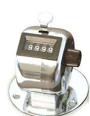

In this exercise we play with counter classes which model the physical devices that people use for counting things:

<p><table><tbody><tr><td colspan="2">9999</td></tr><tr><td><button>Count</button></td><td><button>Reset</button></td></tr></tbody></table></p><br clear="left" />

The skeleton of the classes is given below, you just need to fill in the methods. Note that the different classes inherit each other. When working on a subclass try not to repeat code. Instead use the keyword super to reuse the method in the superclass.

Your tasks are:

1. Complete the methods in class `SimpleCounter` as follows:
  * The `__init__` method must set the initial count to 9999 just like the factory does for the physical counters.
  * Method `count` increments the counter's value by one.
  * `reset` sets the counter back to zero.
  * `getValue` returns the current count.
  Once this is done the buttons "Count" and "Reset" above should work as expected *(will not work here on github)*.
2. The physical counters have an upper limit to the number that they can show. For example the device above can count up to 9999 and after that it goes back to zero. Unlike it, our software model goes up to 10000. Finish the class `BoundedCounter`, which modifies `SimpleCounter` in two ways:
  * The `__init__` method takes two parameters: the initial value `init`, and the upper limit `max`.
  * The method count must be changed so that it counts up to max and then, on the next call the counter should be reset back to zero.
  Once this is done the button "Count" above will not let the number go over 9999 *(will not work here on github)*.
3. `ChainedCounter` is another kind of counter which extends `BoundedCounter` as follows:
  * The `__init__` method takes a third parameter: next, which is a reference to another counter.
  * The `count` function also works differently  –  when the counter turns from max back to zero, it must also call `next.count()`.
  The new `ChainedCounter` can be used to implement a digital clock. When the counter for seconds is 59, it is then reset back to zero, and at the same time the counter for minutes is increased with one. You have to check that next is not `None` before trying to call `next.count()`. The reason is that a chain of counters has to end. For instance, in a clock the counter for hours has no next counter, so it must be constructed with `None` as the third parameter. Once the class is finished the clock bellow will start working *(will not work here on github)*.
  <table><tbody><tr><td>00</td><td>01</td><td>02</td></tr></tbody></table>

```python
class SimpleCounter:
  def __init__(self):
    pass

  def count(self):
    pass

  def reset(self):
    pass

  def getValue(self):
    pass

class BoundedCounter(SimpleCounter):
  def __init__(self,init,max):
    pass

  def count(self):
    pass

class ChainedCounter(BoundedCounter):
  def __init__(self,init,max,next):
    pass

  def count(self):
    pass
```
